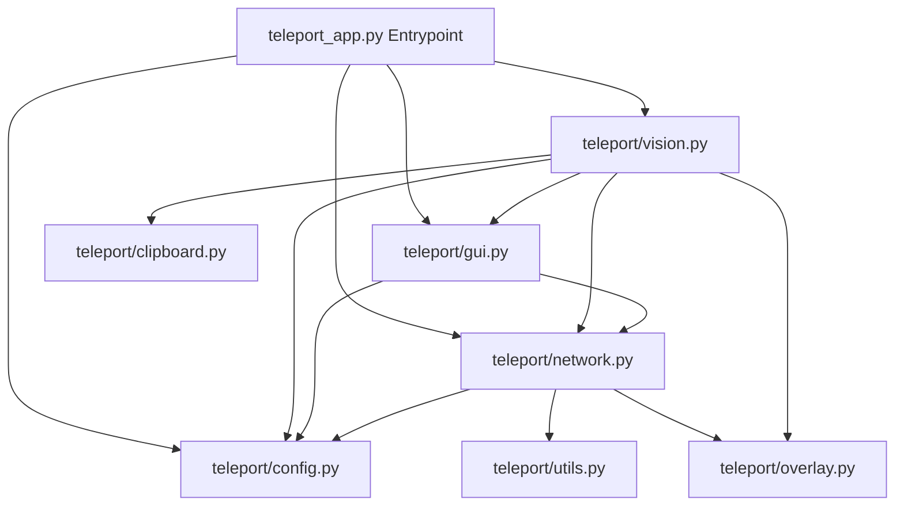

# AirGrab 🌌🖐️

Uma alternativa de código aberto, leve e universal ao sistema de transferência de arquivos por gestos do **Huawei/HarmonyOS Share**. Transfira arquivos entre computadores na mesma rede local de forma mágica, usando apenas a sua webcam, área de transferência (Clipboard) e gestos de mão futuristas.

---

## ✨ Recursos

- **Conexão Direta P2P (Local)**: Descoberta automática de computadores na rede via **UDP Broadcast** e transferências rápidas via sockets **TCP**. Sem servidores em nuvem, totalmente privado.
- **Integração Inteligente com Clipboard**:
  - Em vez de abrir janelas de arquivos nativas e estáticas, o app monitora a área de transferência do seu sistema operacional.
  - Para transferir, basta selecionar o arquivo e pressionar **Ctrl+C** (ou comando Copiar do OS). O AirGrab faz o resto.
- **Gestos de Transição de Estado**:
  - **Agarrar (Origem)**: Comece com a **Mão Aberta** e **Feche o Punho** na frente da câmera para puxar e prender o arquivo copiado.
  - **Soltar (Destino)**: Apresente o **Punho Fechado** e **Abra a Mão** na frente da câmera do computador receptor para receber o arquivo.
  - **Cancelar (Origem)**: Faça o gesto de **"V" (Peace/Paz)** para esvaziar o cache e liberar o arquivo da memória.
- **Interface Flutuante HUD Animada (Pygame)**:
  - Exibe um painel translúcido em estilo **Glassmorphism** flutuando sobre o desktop do Windows (via transparência nativa `ctypes`).
  - Animação líquida fluida de ondas de água (Ripples) e emissores de partículas quando ações são efetuadas.
  - Carrega e exibe miniaturas (previews) reais para imagens ou ícones de documentos estilizados.
- **Multiplataforma**: Projetado para rodar nativamente no Windows, Linux (via `xclip`) e macOS (via `osascript`).

---

## 🛠️ Como Funciona?

O projeto utiliza uma arquitetura modularizada dividida em threads e subprocessos leves:



1. **`config.py`**: Estado global centralizado.
2. **`clipboard.py`**: Acessa a API do Clipboard para ler dados de arquivos copiados (`CF_HDROP` no Windows, `text/uri-list` no Linux, `furl` no macOS).
3. **`overlay.py`**: Laço gráfico em Pygame que cria as janelas de HUD transparentes.
4. **`network.py`**: Comunicação de rede (Sockets UDP na porta `50000` e TCP na porta `50001`).
5. **`vision.py`**: Detector MediaPipe Hand Landmarker com inteligência de gestos e ratios geométricos invariantes de escala.

---

## 🚀 Instalação e Execução

### Pré-requisitos
- Python 3.8 ou superior instalado.
- Uma webcam conectada.
- Computadores na **mesma rede local (Wi-Fi ou Ethernet)**.
- *Apenas no Linux*: Certifique-se de que o utilitário `xclip` está instalado (`sudo apt install xclip`).

### Instalação
1. Clone este repositório:
   ```bash
   git clone https://github.com/seu-usuario/airgrab.git
   cd airgrab
   ```

2. Instale as dependências necessárias:
   ```bash
   pip install -r requirements.txt
   ```

3. Execute o aplicativo:
   ```bash
   python teleport_app.py
   ```

---

## 🎮 Como Usar

### 1. Copie e Agarre (Computador de Origem)
1. Vá até o arquivo que deseja transferir, clique nele e pressione **Ctrl+C** (ou Copiar).
2. Fique de frente para a webcam de origem.
3. Mostre a **Mão Aberta** e em seguida **Feche o Punho**.
4. A tela piscará uma onda verde com o aviso **`AirGrabbed!`**, exibindo o preview e nome do arquivo.
5. O arquivo agora está em cache na rede (você já pode soltar a mão).

### 2. Resgate e Solte (Computador de Destino)
1. Vá ao computador receptor.
2. Mostre o **Punho Fechado** e em seguida **Abra a Mão**.
3. A tela do computador receptor exibirá uma onda azul com o aviso **`AirDropped!`** e a miniatura do arquivo recebido.
4. O arquivo estará salvo na pasta raiz com o prefixo `RECEBIDO_`.

### 3. Cancelando a Transferência
- Caso queira cancelar antes do resgate, faça o gesto de **"V"** (Peace/Paz) na frente da webcam de origem.
- Uma onda vermelha indicará que o arquivo foi limpo da memória. Alternativamente, você pode clicar com o botão direito no ícone da bandeja e escolher **"Soltar Arquivo (...)"**.

---

## 📦 Compilando para Executável (.exe no Windows)

Caso queira gerar o arquivo compilado sem necessidade do Python instalado, execute:

1. Instale o PyInstaller:
   ```bash
   pip install pyinstaller
   ```

2. Compile o spec pré-configurado:
   ```bash
   pyinstaller teleport_app.spec
   ```

3. O executável standalone será gerado na pasta `dist/teleport_app.exe`.

---

## 📄 Licença

Este projeto está sob a licença **MIT** - consulte o arquivo [LICENSE](LICENSE) para obter detalhes.
