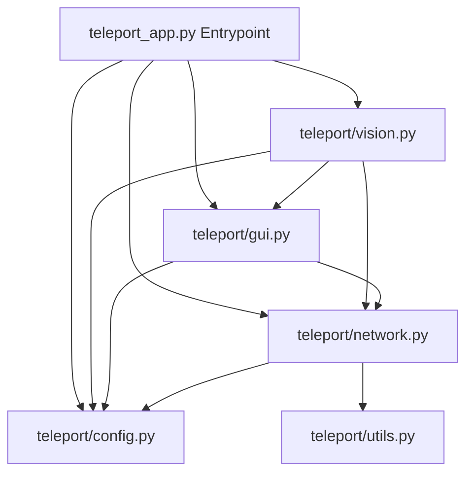

# AirGrab

Uma alternativa de código aberto, leve e universal ao sistema de transferência de arquivos por gestos do **Huawei/HarmonyOS Share**. Transfira arquivos entre computadores na mesma rede local de forma mágica, usando apenas a sua webcam e gestos simples de mão.

---

## Recursos

- **Conexão Direta P2P (Local)**: Descoberta automática de computadores na rede via **UDP Broadcast** e transferências rápidas via sockets **TCP**. Sem servidores em nuvem, totalmente privado.
- **Gestos Inteligentes (Baseados em Transições de Estado)**:
  - **Agarrar (Origem)**: Abra a mão e feche o punho para selecionar o arquivo que deseja enviar.
  - **Soltar (Destino)**: Apresente o punho fechado no outro computador e abra a mão para puxar e salvar o arquivo.
  - **Cancelar (Origem)**: Faça o gesto de "V" (Paz e Amor) para abortar e limpar o arquivo da memória.
- **Menu Integrado na Bandeja (System Tray)**: Controle as funções de Câmera, Compartilhamento e Modo Debug de forma discreta pelo ícone do sistema.
- **Feedback Visual (Modo Debug)**: Tela interativa em tempo real com overlay do esqueleto da mão, gestos identificados e o arquivo em trânsito.
- **Download Automático**: Baixa o modelo leve do **MediaPipe Hand Landmarker** (`hand_landmarker.task`) automaticamente no primeiro início.

---

## Como Funciona?

O projeto utiliza uma arquitetura modularizada e limpa dividida em threads para não congelar a interface ou a câmera:



1. **`config.py`**: Gerencia o estado e as variáveis globais.
2. **`network.py`**: Cuida do servidor TCP receptor (porta `50001`) e da descoberta UDP (porta `50000`).
3. **`gui.py`**: Mantém a bandeja do sistema (`pystray`) e abre a janela do seletor de arquivos.
4. **`vision.py`**: Processa a webcam com OpenCV e MediaPipe para ler as coordenadas da mão e processar transições geométricas invariantes.

---

## Requisitos e Instalação

### Pré-requisitos
- Python 3.8 ou superior instalado.
- Uma webcam conectada.
- Computadores conectados à **mesma rede local (Wi-Fi ou Ethernet)**.

### Instalação
1. Clone este repositório:
   ```bash
   git clone https://github.com/seu-usuario/ai-teleport.git
   cd ai-teleport
   ```

2. Instale as dependências necessárias:
   ```bash
   pip install -r requirements.txt
   ```

3. Execute o aplicativo:
   ```bash
   python teleport_app.py
   ```

---

## Como Usar

### 1. Preparando a Transferência (Computador de Origem)
- Fique de frente para a webcam.
- Mostre a **Mão Aberta** para a câmera.
- **Feche o Punho**.
- Uma janela de arquivos do sistema será aberta. Escolha o arquivo desejado.
- O arquivo agora está em cache na rede aguardando ser puxado (você pode soltar a mão).

### 2. Resgatando o Arquivo (Computador de Destino)
- Vá até o computador de destino que também esteja rodando o app.
- Mostre o **Punho Fechado** para a webcam.
- **Abra a Mão completamente**.
- O arquivo será transferido via rede e salvo na pasta raiz com o prefixo `RECEBIDO_`.

### 3. Cancelando a Transferência
- Se você selecionou o arquivo errado, faça o **Gesto de Paz / V** (dedos Indicador e Médio esticados, Ring e Pinky dobrados) na frente da webcam de origem.
- O arquivo será liberado da memória instantaneamente. Alternativamente, você pode usar a opção **"Soltar Arquivo (...)"** no ícone de bandeja do Windows.

---

## Compilando para Executável (.exe no Windows)

Caso queira gerar um executável independente que não necessite do Python instalado para rodar nas máquinas, use o **PyInstaller** com as configurações do arquivo `.spec` já fornecido:

1. Instale o PyInstaller:
   ```bash
   pip install pyinstaller
   ```

2. Compile usando o arquivo `.spec`:
   ```bash
   pyinstaller teleport_app.spec
   ```

3. O executável standalone será gerado na pasta `dist/teleport_app.exe`.

---

## Licença

Este projeto está sob a licença **MIT** - consulte o arquivo [LICENSE](LICENSE) para obter detalhes.
